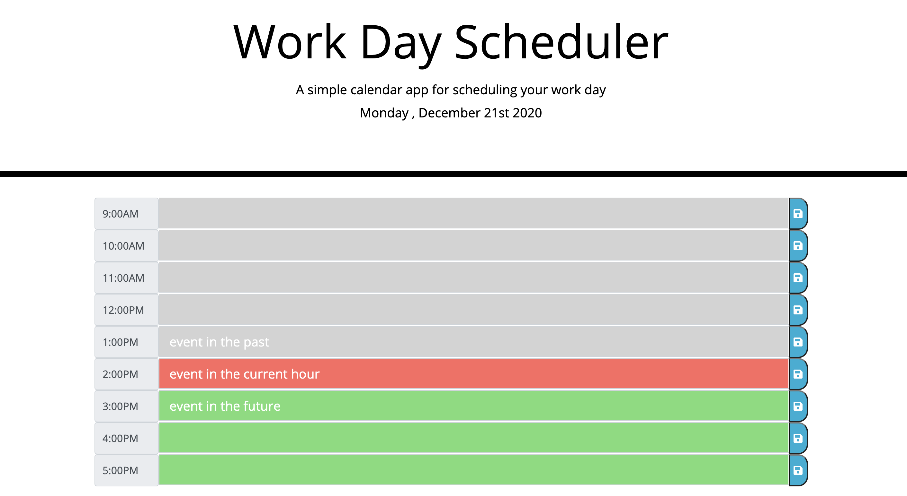

# dynamic_workflow_scheduler
This application of a simple calendar was created for the busy employee. This daily planner allows the employee to add important events to each hour in effort to manage time effectively. When the calendar opens in the browser, the current date is displayed at the top, and time blocks are presented for standard business hours (9am-5pm). Each time block is color-coded to indicate wheter it is in the past, present (current hour), or future. The employee can click on each time block and enter text which is can be saved by clicking on the floppy disk icon. When the page is refreshed, the saved text will remain. 

# Link to Workflow Calendar

https://vpatt1031.github.io/dynamic_workflow_scheduler/

# Screenshot of Workflow Calendar

